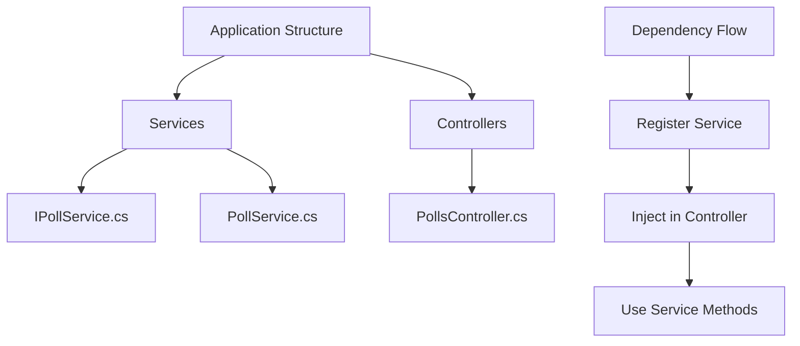
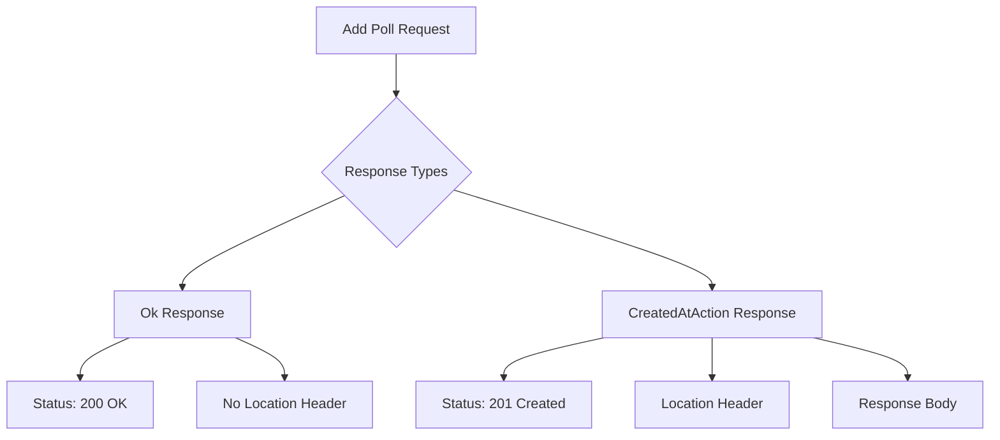
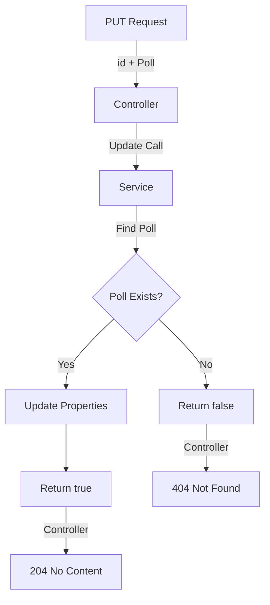
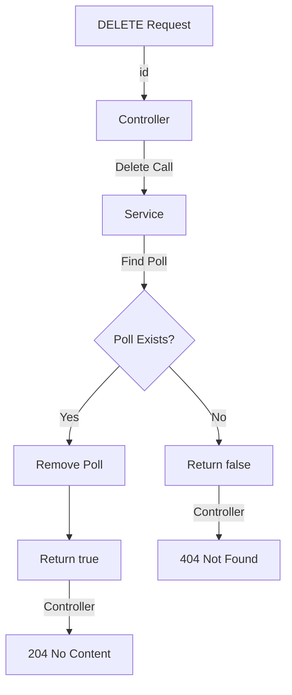
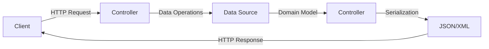

# Service Layer Implementation Guide

## Project Structure


## Service Layer Implementation

### 1. Interface Definition
```csharp
public interface IPollService
{
    IEnumerable<Poll> GetAll();
    Poll? Get(int id);
}
```

### 2. Service Implementation
```csharp
public class PollService : IPollService
{
    private readonly List<Poll> _polls = new()
    {
        new Poll 
        { 
            Id = 1, 
            Title = "Poll1", 
            Description = "My First Poll" 
        }
    };

    public Poll? Get(int id) => _polls.SingleOrDefault(p => p.Id == id);
    
    public IEnumerable<Poll> GetAll() => _polls;
}
```

## Controller Refactoring

### Previous Implementation
```csharp
public class PollsController : ControllerBase
{
    private readonly List<Poll> _polls = new();  // Business logic in controller
    
    [HttpGet]
    public IActionResult GetAll() => Ok(_polls);
}
```

### Improved Implementation
```csharp
public class PollsController : ControllerBase
{
    private readonly IPollService _pollService;

    public PollsController(IPollService pollService)
    {
        _pollService = pollService;
    }

    [HttpGet]
    public IActionResult GetAll() => Ok(_pollService.GetAll());

    [HttpGet("{id}")]
    public IActionResult Get(int id)
    {
        var poll = _pollService.Get(id);
        return poll is null ? NotFound() : Ok(poll);
    }
}
```

### Primary Constructor Syntax (C# 12)
```csharp
public class PollsController(IPollService pollService) : ControllerBase
{
    [HttpGet]
    public IActionResult GetAll() => Ok(pollService.GetAll());
}
```

## Dependency Injection Setup

### Service Registration
```csharp
// In Program.cs
builder.Services.AddScoped<IPollService, PollService>();
```

## Service Lifetimes Comparison

| Lifetime | Description | Best For |
|----------|-------------|----------|
| Scoped | New instance per request | Most business services |
| Singleton | Single instance | Configuration services |
| Transient | New instance each time | Lightweight, stateless services |

## Responsibilities

### Controller
- Receive HTTP requests
- Route to appropriate service
- Return HTTP responses
- Handle HTTP-specific logic

### Service
- Implement business logic
- Data manipulation
- Domain rules
- No HTTP concerns

## Benefits of Service Layer

1. **Separation of Concerns**
   - Controllers handle HTTP
   - Services handle business logic
   - Easier to maintain and test

2. **Reusability**
   - Services can be used by multiple controllers
   - Logic can be shared

3. **Testability**
   - Services can be mocked
   - Controllers are thin
   - Business logic is isolated

## Best Practices

1. **Interface Segregation**
```csharp
public interface IPollService
{
    // Only related methods
    IEnumerable<Poll> GetAll();
    Poll? Get(int id);
}
```

2. **Dependency Injection**
```csharp
// Constructor injection
public class PollsController
{
    private readonly IPollService _pollService;
    public PollsController(IPollService pollService) => 
        _pollService = pollService;
}
```

3. **Service Methods**
```csharp
// Clear, concise methods
public Poll? Get(int id) => _polls.SingleOrDefault(p => p.Id == id);
```

## Next Steps
- Implement remaining CRUD operations
- Add error handling
- Add logging
- Implement caching
- Add validation

---

**Note**: Consider moving to a proper database instead of in-memory List when moving to production.


# Creating New Poll Endpoint Implementation

## Complete Implementation

```csharp
public interface IPollService
{
    // Existing methods
    IEnumerable<Poll> GetAll();
    Poll? Get(int id);
    
    // New method
    Poll Add(Poll poll);
}

public class PollService : IPollService
{
    private static readonly List<Poll> _polls = [
        new Poll { Id = 1, Title = "Poll 1", Description = "My First Poll" }
    ];

    public Poll Add(Poll poll)
    {
        poll.Id = _polls.Count + 1;  // Temporary ID generation
        _polls.Add(poll);
        return poll;
    }
}

public class PollsController : ControllerBase
{
    private readonly IPollService _pollService;

    public PollsController(IPollService pollService)
    {
        _pollService = pollService;
    }

    [HttpPost]
    public IActionResult Add(Poll request)
    {
        var newPoll = _pollService.Add(request);
        return CreatedAtAction(
            nameof(Get),           // Action name
            new { id = newPoll.Id },  // Route values
            newPoll                   // Response body
        );
    }
}
```

## Response Comparison



## Response Options Comparison

| Method | Status Code | Location Header | Best For |
|--------|-------------|-----------------|----------|
| `Ok(newPoll)` | 200 | No | Simple responses |
| `Created(uri, newPoll)` | 201 | Yes (manual) | Custom URIs |
| `CreatedAtAction(...)` | 201 | Yes (automatic) | REST compliance |

## CreatedAtAction Overloads

```csharp
// 1. Basic
CreatedAtAction("Get", newPoll)

// 2. With Route Values
CreatedAtAction("Get", new { id = newPoll.Id }, newPoll)

// 3. With Controller Name
CreatedAtAction("Get", "Polls", new { id = newPoll.Id }, newPoll)
```

## Response Headers

### Using Ok()
```http
Status: 200 OK
Content-Type: application/json
Date: [timestamp]
Server: [server-info]
```

### Using CreatedAtAction()
```http
Status: 201 Created
Content-Type: application/json
Location: https://api/polls/{id}
Date: [timestamp]
Server: [server-info]
```

## Best Practices

1. **Use CreatedAtAction**
```csharp
return CreatedAtAction(
    nameof(Get),  // Use nameof for refactoring support
    new { id = newPoll.Id },
    newPoll
);
```

2. **ID Generation**
```csharp
// Temporary solution for in-memory storage
poll.Id = _polls.Count + 1;

// TODO: Replace with database-generated ID
```

3. **Static List Warning**
```csharp
// Note: Static list is temporary
private static readonly List<Poll> _polls = [...];
```

## Implementation Notes

### Controller
- Uses POST verb
- Accepts Poll object in request body
- Returns 201 Created status
- Includes Location header

### Service
- Handles ID generation (temporary)
- Adds poll to collection
- Returns created poll

## Common Pitfalls

1. **Returning Wrong Status**
```csharp
// Avoid
return Ok(newPoll);  // 200 OK

// Prefer
return CreatedAtAction(...);  // 201 Created
```

2. **Missing Location Header**
```csharp
// Avoid
return Created("", newPoll);  // Empty URI

// Prefer
return CreatedAtAction(nameof(Get), ...);  // Full URI
```

## Next Steps
- Add input validation
- Implement proper ID generation
- Add error handling
- Add duplicate checking
- Implement database storage

---

**Note**: The current ID generation method is temporary and should be replaced with proper database-generated IDs in production.


# Update Endpoint Implementation

## Complete Implementation

```csharp
public interface IPollService
{
    // Existing methods
    IEnumerable<Poll> GetAll();
    Poll? Get(int id);
    Poll Add(Poll poll);
    
    // New method
    bool Update(int id, Poll poll);
}

public class PollService : IPollService
{
    public bool Update(int id, Poll poll)
    {
        var currentPoll = Get(id);
        if (currentPoll is null)
            return false;
            
        currentPoll.Title = poll.Title;
        currentPoll.Description = poll.Description;
        return true;
    }
}

public class PollsController : ControllerBase
{
    private readonly IPollService _pollService;

    [HttpPut("{id}")]
    public IActionResult Update(int id, Poll request)
    {
        var isUpdated = _pollService.Update(id, request);
        return isUpdated ? NoContent() : NotFound();
    }
}
```

## Flow Diagram


## Response Status Codes

| Scenario | Status Code | Description | Response Body |
|----------|-------------|-------------|---------------|
| Success | 204 | No Content | Empty |
| Not Found | 404 | Not Found | Empty |

## Method Signatures

### Controller
```csharp
[HttpPut("{id}")]
public IActionResult Update(int id, Poll request)
```

### Service Interface
```csharp
bool Update(int id, Poll poll)
```

### Service Implementation
```csharp
public bool Update(int id, Poll poll)
{
    var currentPoll = Get(id);
    if (currentPoll is null)
        return false;
        
    currentPoll.Title = poll.Title;
    currentPoll.Description = poll.Description;
    return true;
}
```

## Update Process Steps

1. **Request Handling**
   ```csharp
   [HttpPut("{id}")]
   public IActionResult Update(int id, Poll request)
   ```

2. **Service Call**
   ```csharp
   var isUpdated = _pollService.Update(id, request);
   ```

3. **Response Generation**
   ```csharp
   return isUpdated ? NoContent() : NotFound();
   ```

## Best Practices

1. **Return Types**
   ```csharp
   // Service: Boolean for success/failure
   bool Update(int id, Poll poll)

   // Controller: IActionResult for HTTP responses
   IActionResult Update(int id, Poll request)
   ```

2. **Response Codes**
   ```csharp
   // Success: 204 No Content
   return NoContent();

   // Not Found: 404
   return NotFound();
   ```

3. **Null Checking**
   ```csharp
   if (currentPoll is null)
       return false;
   ```

## Implementation Notes

### Service Layer
- Uses existing Get method for finding poll
- Returns boolean for operation result
- Updates properties directly

### Controller Layer
- Uses PUT HTTP method
- Accepts ID from route
- Accepts Poll from request body
- Returns appropriate status codes

## Common Patterns

### Ternary Response
```csharp
// Concise way to return response
return isUpdated ? NoContent() : NotFound();
```

### Property Update
```csharp
currentPoll.Title = poll.Title;
currentPoll.Description = poll.Description;
```

## Next Steps
- Add validation
- Implement concurrency checking
- Add partial updates (PATCH)
- Add audit trails
- Implement error logging

## Common Issues

| Issue | Solution |
|-------|----------|
| Concurrent Updates | Implement optimistic concurrency |
| Partial Updates | Consider using HTTP PATCH |
| Data Validation | Add request validation |

---

**Note**: In a production environment, consider adding validation, logging, and proper error handling for edge cases.


# Delete Endpoint Implementation

## Complete Implementation

```csharp
public interface IPollService
{
    // Existing methods
    IEnumerable<Poll> GetAll();
    Poll? Get(int id);
    Poll Add(Poll poll);
    bool Update(int id, Poll poll);
    
    // New method
    bool Delete(int id);
}

public class PollService : IPollService
{
    private static readonly List<Poll> _polls = [...];

    public bool Delete(int id)
    {
        var poll = Get(id);
        if (poll is null)
            return false;
            
        _polls.Remove(poll);
        return true;
    }
}

public class PollsController : ControllerBase
{
    private readonly IPollService _pollService;

    [HttpDelete("{id}")]
    public IActionResult Delete(int id)
    {
        var isDeleted = _pollService.Delete(id);
        return isDeleted ? NoContent() : NotFound();
    }
}
```

## Flow Diagram


## Response Status Codes

| Status Code | Scenario | Response Body | Description |
|------------|----------|---------------|-------------|
| 204 | Success | Empty | Resource successfully deleted |
| 404 | Not Found | Empty | Resource doesn't exist |

## Method Signatures

### Controller Layer
```csharp
[HttpDelete("{id}")]
public IActionResult Delete(int id)
```

### Service Layer
```csharp
// Interface
bool Delete(int id);

// Implementation
public bool Delete(int id)
```

## Implementation Details

### 1. Controller Implementation
```csharp
[HttpDelete("{id}")]
public IActionResult Delete(int id)
{
    var isDeleted = _pollService.Delete(id);
    return isDeleted ? NoContent() : NotFound();
}
```

### 2. Service Implementation
```csharp
public bool Delete(int id)
{
    var poll = Get(id);
    if (poll is null)
        return false;
        
    _polls.Remove(poll);
    return true;
}
```

## Best Practices

1. **Status Codes**
   ```csharp
   // Success
   return NoContent();  // 204

   // Not Found
   return NotFound();   // 404
   ```

2. **Service Response**
   ```csharp
   // Boolean for operation success/failure
   bool Delete(int id)
   ```

3. **Null Checking**
   ```csharp
   if (poll is null)
       return false;
   ```

## Common Patterns

### Ternary Response
```csharp
return isDeleted ? NoContent() : NotFound();
```

### Entity Removal
```csharp
_polls.Remove(poll);
```

## DELETE Operation Steps

1. **Receive Request**
   - Get ID from route parameter

2. **Find Resource**
   - Use existing Get method

3. **Remove Resource**
   - Remove from collection if found

4. **Return Response**
   - 204 if successful
   - 404 if not found

## Validation Checks

| Check | Action | Result |
|-------|--------|--------|
| Invalid ID | Return false | 404 Response |
| Poll not found | Return false | 404 Response |
| Successful deletion | Return true | 204 Response |

## Next Steps
- Add soft delete
- Implement deletion logging
- Add authorization checks
- Handle cascade deletes
- Add recovery options

## Common Issues and Solutions

| Issue | Solution |
|-------|----------|
| Cascade Deletion | Implement related data handling |
| Audit Trail | Add deletion logging |
| Recovery | Implement soft delete |
| Authorization | Add permission checks |

---

**Note**: In a production environment, consider implementing soft delete instead of hard delete, and ensure proper authorization before deletion.


# API Request/Response Flow Documentation

## Current Implementation Flow



## Current Implementation Status

### Completed Features
1. Basic CRUD Operations
   - GetAll
   - Get by ID
   - Add
   - Update
   - Delete

2. In-Memory Data Storage
   ```csharp
   private static readonly List<Poll> _polls = new();
   ```

3. Service Layer Pattern
   ```csharp
   public interface IPollService
   {
       IEnumerable<Poll> GetAll();
       Poll? Get(int id);
       Poll Add(Poll poll);
       bool Update(int id, Poll poll);
       bool Delete(int id);
   }
   ```

## Git Version Control

### Commit Process
1. Open Git Changes
2. Review modified files
3. Add commit message:
   ```
   Add CRUD Operations to polls controller
   ```
4. Commit All
5. Push changes

## Areas for Improvement

| Area | Current State | Future Improvement |
|------|--------------|-------------------|
| Data Storage | In-memory List | SQL Database |
| Model Binding | Basic | Enhanced validation |
| Domain Models | Direct usage | DTOs/ViewModels |
| Validation | None | Client/Server validation |

## Request/Response Flow Details

### 1. Client Request
- HTTP method (GET, POST, PUT, DELETE)
- URL endpoint
- Optional body data
- Headers

### 2. Controller Processing
```csharp
[HttpGet]
public IActionResult GetAll()
{
    var result = _pollService.GetAll();
    return Ok(result);
}
```

### 3. Data Operations
- CRUD operations via service layer
- Currently using in-memory list
- Future: Database operations

### 4. Response Types
| Operation | Response Type | Status Code |
|-----------|--------------|-------------|
| Get | Data + 200 | OK |
| Create | Data + 201 | Created |
| Update | 204 | No Content |
| Delete | 204 | No Content |

### 5. Serialization
- JSON by default
- Content negotiation available
- Response formatting

## Next Steps

1. **Database Integration**
   - Replace in-memory storage
   - Add proper data context
   - Implement repositories

2. **Model Improvements**
   ```csharp
   public class PollDto
   {
       // Separate from domain model
   }
   ```

3. **Validation**
   ```csharp
   public class PollValidator
   {
       // Add validation rules
   }
   ```

4. **Model Binding**
   ```csharp
   [ApiController]
   public class PollsController
   {
       // Enhanced model binding
   }
   ```

---

**Note**: The current implementation provides basic CRUD functionality but needs enhancements for production use, particularly in areas of data persistence, validation, and model separation.
