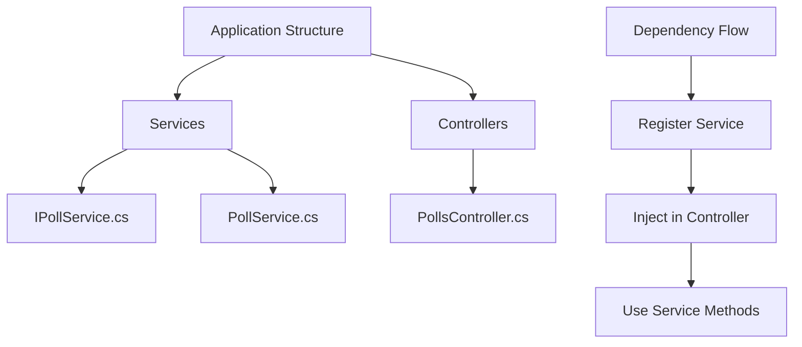
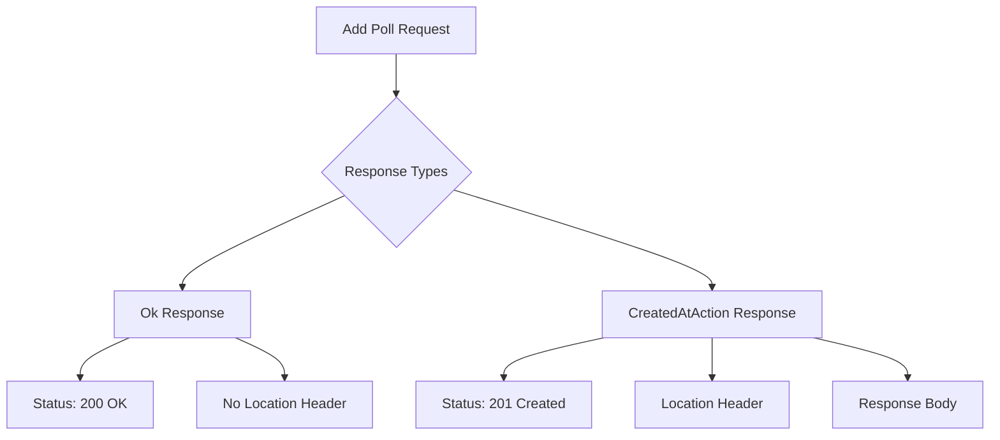

# Service Layer Implementation Guide

## Project Structure


## Service Layer Implementation

### 1. Interface Definition
```csharp
public interface IPollService
{
    IEnumerable<Poll> GetAll();
    Poll? Get(int id);
}
```

### 2. Service Implementation
```csharp
public class PollService : IPollService
{
    private readonly List<Poll> _polls = new()
    {
        new Poll 
        { 
            Id = 1, 
            Title = "Poll1", 
            Description = "My First Poll" 
        }
    };

    public Poll? Get(int id) => _polls.SingleOrDefault(p => p.Id == id);
    
    public IEnumerable<Poll> GetAll() => _polls;
}
```

## Controller Refactoring

### Previous Implementation
```csharp
public class PollsController : ControllerBase
{
    private readonly List<Poll> _polls = new();  // Business logic in controller
    
    [HttpGet]
    public IActionResult GetAll() => Ok(_polls);
}
```

### Improved Implementation
```csharp
public class PollsController : ControllerBase
{
    private readonly IPollService _pollService;

    public PollsController(IPollService pollService)
    {
        _pollService = pollService;
    }

    [HttpGet]
    public IActionResult GetAll() => Ok(_pollService.GetAll());

    [HttpGet("{id}")]
    public IActionResult Get(int id)
    {
        var poll = _pollService.Get(id);
        return poll is null ? NotFound() : Ok(poll);
    }
}
```

### Primary Constructor Syntax (C# 12)
```csharp
public class PollsController(IPollService pollService) : ControllerBase
{
    [HttpGet]
    public IActionResult GetAll() => Ok(pollService.GetAll());
}
```

## Dependency Injection Setup

### Service Registration
```csharp
// In Program.cs
builder.Services.AddScoped<IPollService, PollService>();
```

## Service Lifetimes Comparison

| Lifetime | Description | Best For |
|----------|-------------|----------|
| Scoped | New instance per request | Most business services |
| Singleton | Single instance | Configuration services |
| Transient | New instance each time | Lightweight, stateless services |

## Responsibilities

### Controller
- Receive HTTP requests
- Route to appropriate service
- Return HTTP responses
- Handle HTTP-specific logic

### Service
- Implement business logic
- Data manipulation
- Domain rules
- No HTTP concerns

## Benefits of Service Layer

1. **Separation of Concerns**
   - Controllers handle HTTP
   - Services handle business logic
   - Easier to maintain and test

2. **Reusability**
   - Services can be used by multiple controllers
   - Logic can be shared

3. **Testability**
   - Services can be mocked
   - Controllers are thin
   - Business logic is isolated

## Best Practices

1. **Interface Segregation**
```csharp
public interface IPollService
{
    // Only related methods
    IEnumerable<Poll> GetAll();
    Poll? Get(int id);
}
```

2. **Dependency Injection**
```csharp
// Constructor injection
public class PollsController
{
    private readonly IPollService _pollService;
    public PollsController(IPollService pollService) => 
        _pollService = pollService;
}
```

3. **Service Methods**
```csharp
// Clear, concise methods
public Poll? Get(int id) => _polls.SingleOrDefault(p => p.Id == id);
```

## Next Steps
- Implement remaining CRUD operations
- Add error handling
- Add logging
- Implement caching
- Add validation

---

**Note**: Consider moving to a proper database instead of in-memory List when moving to production.


# Creating New Poll Endpoint Implementation

## Complete Implementation

```csharp
public interface IPollService
{
    // Existing methods
    IEnumerable<Poll> GetAll();
    Poll? Get(int id);
    
    // New method
    Poll Add(Poll poll);
}

public class PollService : IPollService
{
    private static readonly List<Poll> _polls = [
        new Poll { Id = 1, Title = "Poll 1", Description = "My First Poll" }
    ];

    public Poll Add(Poll poll)
    {
        poll.Id = _polls.Count + 1;  // Temporary ID generation
        _polls.Add(poll);
        return poll;
    }
}

public class PollsController : ControllerBase
{
    private readonly IPollService _pollService;

    public PollsController(IPollService pollService)
    {
        _pollService = pollService;
    }

    [HttpPost]
    public IActionResult Add(Poll request)
    {
        var newPoll = _pollService.Add(request);
        return CreatedAtAction(
            nameof(Get),           // Action name
            new { id = newPoll.Id },  // Route values
            newPoll                   // Response body
        );
    }
}
```

## Response Comparison



## Response Options Comparison

| Method | Status Code | Location Header | Best For |
|--------|-------------|-----------------|----------|
| `Ok(newPoll)` | 200 | No | Simple responses |
| `Created(uri, newPoll)` | 201 | Yes (manual) | Custom URIs |
| `CreatedAtAction(...)` | 201 | Yes (automatic) | REST compliance |

## CreatedAtAction Overloads

```csharp
// 1. Basic
CreatedAtAction("Get", newPoll)

// 2. With Route Values
CreatedAtAction("Get", new { id = newPoll.Id }, newPoll)

// 3. With Controller Name
CreatedAtAction("Get", "Polls", new { id = newPoll.Id }, newPoll)
```

## Response Headers

### Using Ok()
```http
Status: 200 OK
Content-Type: application/json
Date: [timestamp]
Server: [server-info]
```

### Using CreatedAtAction()
```http
Status: 201 Created
Content-Type: application/json
Location: https://api/polls/{id}
Date: [timestamp]
Server: [server-info]
```

## Best Practices

1. **Use CreatedAtAction**
```csharp
return CreatedAtAction(
    nameof(Get),  // Use nameof for refactoring support
    new { id = newPoll.Id },
    newPoll
);
```

2. **ID Generation**
```csharp
// Temporary solution for in-memory storage
poll.Id = _polls.Count + 1;

// TODO: Replace with database-generated ID
```

3. **Static List Warning**
```csharp
// Note: Static list is temporary
private static readonly List<Poll> _polls = [...];
```

## Implementation Notes

### Controller
- Uses POST verb
- Accepts Poll object in request body
- Returns 201 Created status
- Includes Location header

### Service
- Handles ID generation (temporary)
- Adds poll to collection
- Returns created poll

## Common Pitfalls

1. **Returning Wrong Status**
```csharp
// Avoid
return Ok(newPoll);  // 200 OK

// Prefer
return CreatedAtAction(...);  // 201 Created
```

2. **Missing Location Header**
```csharp
// Avoid
return Created("", newPoll);  // Empty URI

// Prefer
return CreatedAtAction(nameof(Get), ...);  // Full URI
```

## Next Steps
- Add input validation
- Implement proper ID generation
- Add error handling
- Add duplicate checking
- Implement database storage

---

**Note**: The current ID generation method is temporary and should be replaced with proper database-generated IDs in production.
