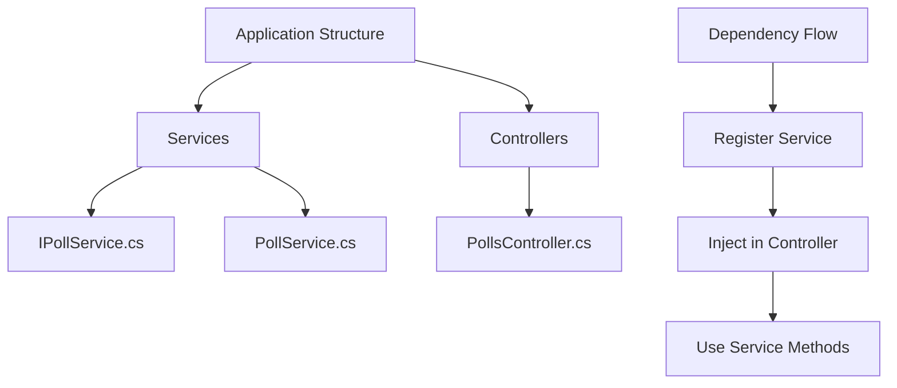

# Service Layer Implementation Guide

## Project Structure


## Service Layer Implementation

### 1. Interface Definition
```csharp
public interface IPollService
{
    IEnumerable<Poll> GetAll();
    Poll? Get(int id);
}
```

### 2. Service Implementation
```csharp
public class PollService : IPollService
{
    private readonly List<Poll> _polls = new()
    {
        new Poll 
        { 
            Id = 1, 
            Title = "Poll1", 
            Description = "My First Poll" 
        }
    };

    public Poll? Get(int id) => _polls.SingleOrDefault(p => p.Id == id);
    
    public IEnumerable<Poll> GetAll() => _polls;
}
```

## Controller Refactoring

### Previous Implementation
```csharp
public class PollsController : ControllerBase
{
    private readonly List<Poll> _polls = new();  // Business logic in controller
    
    [HttpGet]
    public IActionResult GetAll() => Ok(_polls);
}
```

### Improved Implementation
```csharp
public class PollsController : ControllerBase
{
    private readonly IPollService _pollService;

    public PollsController(IPollService pollService)
    {
        _pollService = pollService;
    }

    [HttpGet]
    public IActionResult GetAll() => Ok(_pollService.GetAll());

    [HttpGet("{id}")]
    public IActionResult Get(int id)
    {
        var poll = _pollService.Get(id);
        return poll is null ? NotFound() : Ok(poll);
    }
}
```

### Primary Constructor Syntax (C# 12)
```csharp
public class PollsController(IPollService pollService) : ControllerBase
{
    [HttpGet]
    public IActionResult GetAll() => Ok(pollService.GetAll());
}
```

## Dependency Injection Setup

### Service Registration
```csharp
// In Program.cs
builder.Services.AddScoped<IPollService, PollService>();
```

## Service Lifetimes Comparison

| Lifetime | Description | Best For |
|----------|-------------|----------|
| Scoped | New instance per request | Most business services |
| Singleton | Single instance | Configuration services |
| Transient | New instance each time | Lightweight, stateless services |

## Responsibilities

### Controller
- Receive HTTP requests
- Route to appropriate service
- Return HTTP responses
- Handle HTTP-specific logic

### Service
- Implement business logic
- Data manipulation
- Domain rules
- No HTTP concerns

## Benefits of Service Layer

1. **Separation of Concerns**
   - Controllers handle HTTP
   - Services handle business logic
   - Easier to maintain and test

2. **Reusability**
   - Services can be used by multiple controllers
   - Logic can be shared

3. **Testability**
   - Services can be mocked
   - Controllers are thin
   - Business logic is isolated

## Best Practices

1. **Interface Segregation**
```csharp
public interface IPollService
{
    // Only related methods
    IEnumerable<Poll> GetAll();
    Poll? Get(int id);
}
```

2. **Dependency Injection**
```csharp
// Constructor injection
public class PollsController
{
    private readonly IPollService _pollService;
    public PollsController(IPollService pollService) => 
        _pollService = pollService;
}
```

3. **Service Methods**
```csharp
// Clear, concise methods
public Poll? Get(int id) => _polls.SingleOrDefault(p => p.Id == id);
```

## Next Steps
- Implement remaining CRUD operations
- Add error handling
- Add logging
- Implement caching
- Add validation

---

**Note**: Consider moving to a proper database instead of in-memory List when moving to production.
